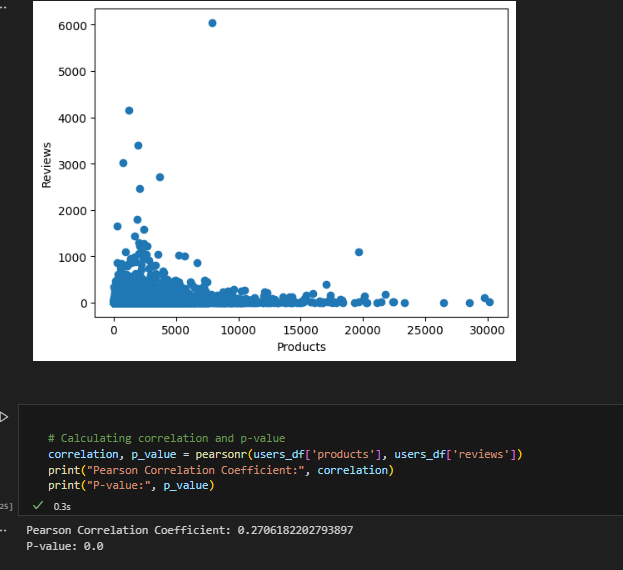
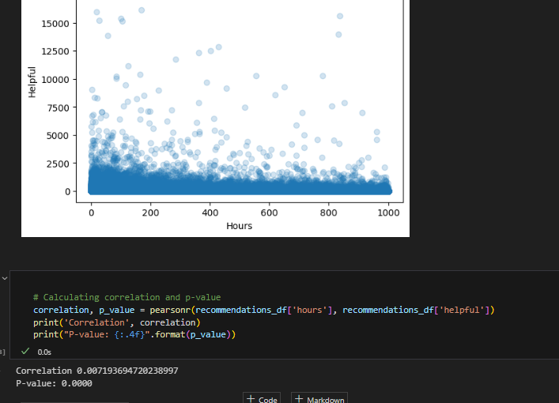

# Check 2

games.csv

| Feature        | Variable Type | Description                 | Example            | Category   |
| -------------- | ------------- | --------------------------- | ------------------ | ---------- |
| app_id         | int           | Unique identifier of a game | 113020             | Identifier |
| title          | string        | Title of a game             | Escape Dead Island | Identifier |
| date_release   | date          | Release date of a game      | 2014-11-21         | Continuous |
| win            | bool          | Windows OS support          | True               | Category   |
| mac            | bool          | Mac OS support              | False              | Category   |
| linux          | bool          | Linux OS support            | False              | Category   |
| rating         | float         | Average rating of a game    | 3.0                | Continuous |
| positive ratio | float         | Ratio of positive reviews   | 0.5                | Continuous |
| user_reviews   | int           | Number of user reviews      | 0                  | Continuous |

recommendations.csv

| feature        | Variable Type | Description                      | Example    | Category   |
| -------------- | ------------- | -------------------------------- | ---------- | ---------- |
| app_id         | int           | Unique identifier of a game      | 113020     | Identifier |
| helpful        | int           | Number of helpful reviews        | 0          | Continuous |
| funny          | int           | Number of funny reviews          | 0          | Continuous |
| date           | date          | Date of a review                 | 2014-11-21 | Continuous |
| is_recommended | bool          | Whether a user recommends a game | True       | Category   |
| hours          | float         | Number of hours played           | 0.0        | Continuous |
| user_id        | int           | Unique identifier of a user      | 5250       | Identifier |
| review_id      | int           | Unique identifier of a review    | 1          | Identifier |

users.csv

| Feature  | Variable Type | Description                 | Example | Category   |
| -------- | ------------- | --------------------------- | ------- | ---------- |
| user_id  | int           | Unique identifier of a user | 5250    | Identifier |
| products | int           | Count of purchased products | 1       | Continuous |
| reviews  | int           | Count of published reviews  | 0       | Continuous |

Notes:
- I am reducing the size so that it is maneagable from my side (original data scales to gb size reduced to first 150 mb)
  - Reduction strategy attached as `split_data.ipynb`
- 

## *Questions I want to answer

- Find if there is a correlation between the number of reviews and the number of products purchased by a user.
  

> This suggest a weak correlation between the number of reviews and the number of products purchased by a user.
> Also suggest that it is statistical significant, such that it is not due to random chance.
  
- Does players with more hours played provide more helpful reviews? What is the relation between hours played and the review result?

> No correlation between hours played and helpful reviews.

- Find if there is an relation with the users count of games and total hours played and the reviews posted. 

- Find if there are relations between: rating, prices, reviews, positive ratio, ratio
- Find the clusters of users based on reviews provided and activity.
- Find the clusters of games based on the reviews

## Visualization Planned

- Clustering from the perspective of:
  - Games
  - Recommendation
  - Users
- Relationship if any between:
  - Number of reviews and the number of products purchased by a user
  - Hours played and helpful reviews
  - Users count of games and total hours played and the reviews posted
  - Rating, prices, reviews, positive ratio, ratio

# Notes:

 - 
