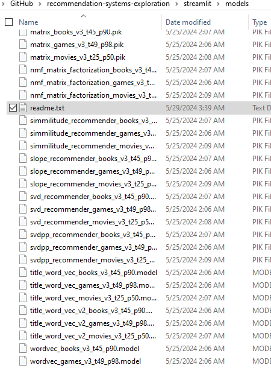

# Explorations in Recommendation Systems

This project intention is to explore different common recommendation strategies.

The definitions presented in this report are a compilation and reinterpretation sourced from various references, each attributed in my best capacity. It is important to clarify that I did not develop nor contribute to the creation of any of the algorithms discussed. Rather, I have packaged them into a standardized interface for the purpose of testing and exploring different recommendation systems with modifications to suit the testing and implementation frameworks.

## Installation

Download also the proper libraries from `requirements.txt` and `spacy` models:

```
python -m venv venv
source venv/bin/activate
pip install -r requirements.txt --upgrade

python -m spacy download en_core_web_sm
```

Running Locally (Streamlit):


```
cd streamlit
# UNZIP data.zip inside of streamlit folder
python model_makers.py 
streamlit run main.py
```

Make sure you populate the models folders:




## Structure

- Streamlit: Application
-   Custom Recommneder Engine: https://github.com/NeneWang/recommendation-systems-exploration/blob/master/streamlit/customrec_engine.py
-   Contains all the code for the recommender engines used on the Streamlit Application
- Enhancement: all Models tests and recommendation engiens tests | Here is where the [written report](https://hackmd.io/@n_1IfOpxQPSjyRrn5yedJw/HkhYoMYfC#All-Datasets) focuses on.
-   Custom Recommender Engine: https://github.com/NeneWang/recommendation-systems-exploration/blob/master/enhancement/customrec_engine.py
-   Constains all the code for the recommenders

## Deployment

If deploying on streamlit, I using instead:

```
engines_list_streamlit
engines_streamlit
```

Please download the books and datasets from the following links:

https://www.kaggle.com/datasets/arashnic/book-recommendation-dataset?resource=download

Extract them into the `data` folder 

## Structure


## Troubleshooting

### Trouble Pulling the right version?
```
git pull -X theirs
```


## Project Structure

- Enhancement: Exploration into the different types of recommendation systems. And Concrete implementation on the datasets we will be handling.


## Guides and learn More:

Some of the code were taken from the following guides, I included code that I used for testing the models.

- [Hands-On Recommendation Systems with Python](https://subscription.packtpub.com/book/data/9781788993753/1/ch01lvl1sec04/types-of-recommender-systems)
- [Video Based: Recommender Systems with Machine Learning](https://subscription.packtpub.com/video/data/9781837631667/p3/video3_1/section-overview)
- [Recommender Systems Complete](https://subscription.packtpub.com/video/programming/9781837632039)

## Some Books To Buy

## Report

| Date                | Details                                  |
| ------------------- | ---------------------------------------- |
| 2024-03-28 18:15:57 | Finished Reading Hands On Recommendation |


