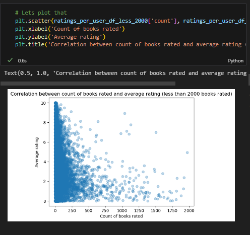
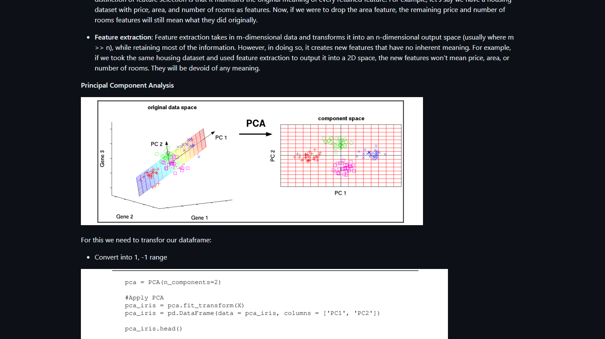
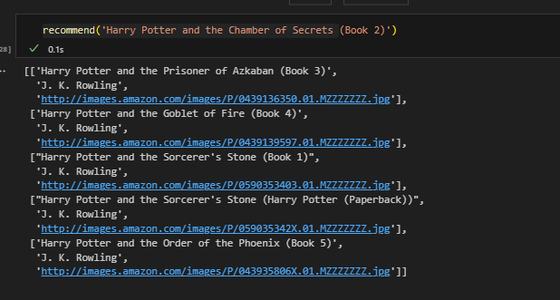
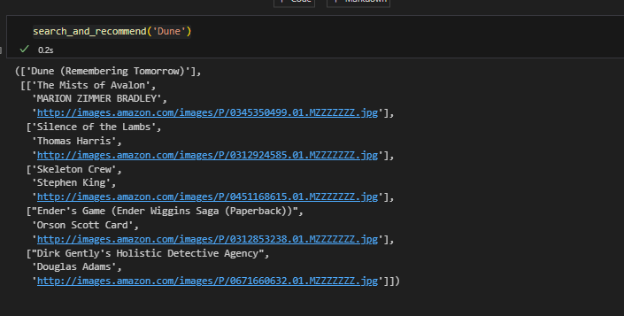
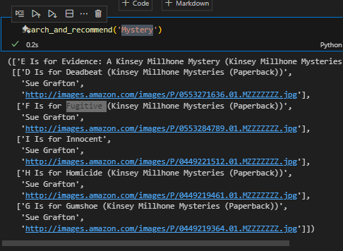
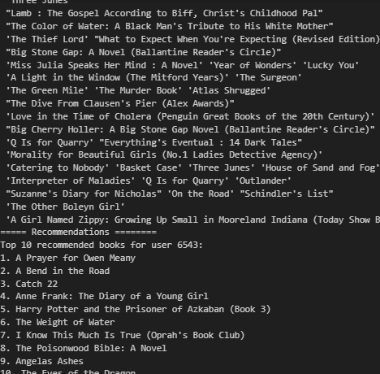
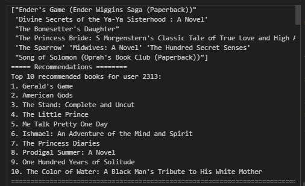
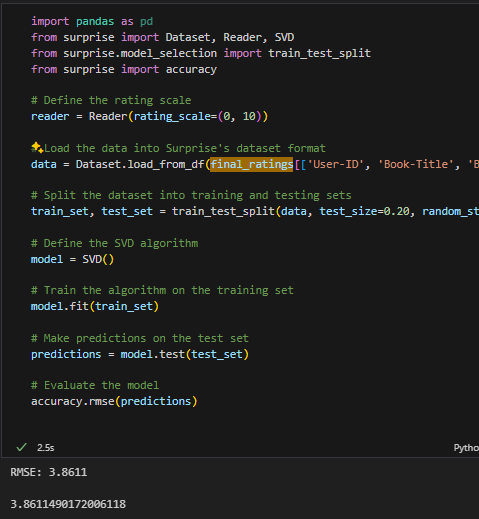

## Planning


*As I go learn more in the process, I find myself wanting to enhance the end product of the project.*


Here the models I will be attempting to make for each Dataset:

### Objectives

Ranked by priority:
1. Building the top 3 models: (do the first two first.)
	1. Collab Filtering KNN
	2. Collab Filtering Cosine 
	3. SVD Model
	4. Content Based WordVec
2. Building an explanation of a document explaining each model
3. Building for top 2 Datasets.
	1. Books
	2. Movies
4. Make it live.
5. Building for rest of models
6. Building for rest of datasets


### Architecture

#### Recommender Model Architecture

All recommenders by implementing the following interfaces.

```
UserRecommender:
This recommends based on the previous actions of a specific user.
- init()
# To be called once at the server start.
# calls 

- func recommend(userHistory, n=10, options={}): List[id]
# Here options is used for the recommendation specific.

- Title: str
- Link explainatition: str
- Ranking: int
- Short Description: str
- slug: str
```

It can be the situation in which some models such as: Content Based Recommenders since they are product like oriented, the idea is to pick 1-2 similar products and add that on the recommendation List (What you would consider as the Steam featured List).

It might be a chance that 

### Models

- Simple Rating Based: Top Rating first, and filter depending on boundaries of search.
- Content based (Vectorizing words)
- Collaborative Filtering
	- Cosine Similarities of the ratings, and who rates them. 
		- Mean Rating
		- Weighted Mean
		- Replace with 0
	- Surprise Package: Prediction Algorithms
		- random_pred.NormalPredictor
		- baseline_only.BaselineOnly
		- knns.KNNBasic
		- knns.KNNWithMeans
		- knns.KNNWithZScore
		- knns.KNNBaseline
		- matrix_factorization.SVD
		- matrix_factorization.NMF
		- slope_one.SlopeOne
		- co_clustering.CoClustering


### Datasets

Lets start with Books:

But once I have time, you should def consider the following: (Ranked)

1. Movies: Reason: has wide description, casts, etc.
2. 
### Terms and Definitions

*I will also be collecting here some terms and definitions I might come across that I might have not understood while reading documentation/etc.*


precision@k and recall@k


### Interactive Prototype Design

https://balsamiq.cloud/svvoo1j/p320vfi/rE9EE


## Week 1: 3-9: Tools Exploration

- Started exploring Books Data
- Exploring Books and planning the project



> Look at `enhancement/Book_exploration.ipynb` for more details.

## Week 2: 10-16: Start Study

- Learning Recommendation Systems using Book: Hands-On Recommendation Systems with Python


**Key Lessons from reading the book**

Here the following standard ways to have create recommendation systems:

- Simple Rating Based: Top Rating first, and filter depending on boundaries of search.
- Content based (Vectorizing words)
	- Creating a soup of title, description, categories, crew | Plot based.
	- Use Cosine Similarity.
	- Sorted by Grades (Scores/Votes).
- Collaborative Filtering
	- Cosine Similarities of the ratings, and who rates them. 
		- Mean Rating
		- Weighted Mean
		- Replace with 0
	- Surprise Package: Prediction Algorithms
		- random_pred.NormalPredictor
		- baseline_only.BaselineOnly
		- knns.KNNBasic
		- knns.KNNWithMeans
		- knns.KNNWithZScore
		- knns.KNNBaseline
		- matrix_factorization.SVD
		- matrix_factorization.NMF
		- slope_one.SlopeOne
		- co_clustering.CoClustering


	

## Week 3: 17-23 - Finish Study

- Continued.. | Finished reading the book: Hands-On Recommendation Systems with Python

- I made a more in depth summary on the following repository:

```
https://github.com/NeneWang/nenewang.github.io/blob/main/Hands-On-Recommendation-Systems-with-Python/hands-on-machine-learning-exploration-report.md
```




## Week 4: 24-30 Core Models Dev


### Exploring Matrix Factorization (Applying Knowledge)

- Implemented the following attempts to build a simple recommendation:
    - cosine_similarity: for the individual Books.
      - Tested with different filters to control the quality of the dataset:
        - filter where the users had not graded more than x books.
        - filter where book had not been graded more than x times.
    - KNN using Surprise
    - SDV using Surprise


So far, it looks like Cosine Similarity is good at identifying similar books:



> Here for example, looking at a book  by searching Harry Potter series, recommend other Harrypoter books.



> Here it shows that people looking for Dune, also seems fo like other Sci-fi books (Even if the categories is not available as a feature!)



> It looks like searcing mystery, and having E's is for evidence as well. find sother similar books.

When it gets to testing using Matrix Factorization,it looks like there is not a strong relation between the books and the recommendations (it does change, and sometimes you can see them, but is not as obvious.)


> Here I am exploring all users with more than 10 books rated, and looking at their recommendations:



> You can see at each image, that the recommendations does infact change depending on what they have rated before.



This high non obvious link could be be given the large RMSE (Root Mean Squared Error) for it's predictions:



I also started writing my report here, to have documentation somewhere. **I will start writing in a more intense level here.**

### Personal measure of success and testing for the recommendation algorithms.

My objective for today is to: 
- Create a better definition of how I am measuring my models taking inspiration of Surprise Package.
- 

Taking inspiration of how models are evaluated using accuracy module:


To consider:

- Because I will be testing very distinct ways to create recommendations (content, Matrix, SVD, I have to create an evaluation metric that fits all)

Draft:
- Split Training and testing dataset (through users).
- On Testing: Test by removing the last book read.
- See if any of the top 20 recommendation includes the book that is missing.
- If is found, grade by stating true/false. 
### Developing the first personal-metric evaluated model.

I will be jotting down this on the [Planning](#Planning) section


## Week 5: 31 March-6 April 2024


