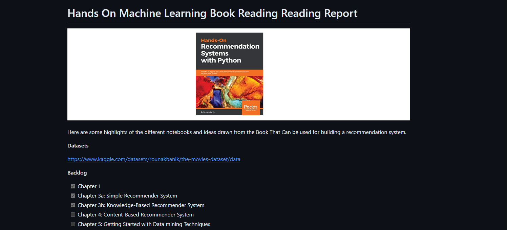

## Week 1: 3-9 March 2024

- Started exploring Books Data


> Look at `enhancement/Book_exploration.ipynb` for more details.

## Week 2: 10-16 March 2024

- Learning Recommendation Systems using Book: Hands-On Recommendation Systems with Python



## Week 3: 17-23 March 2024

- Continued.. | Finished reading the book: Hands-On Recommendation Systems with Python

- I made a more in depth summary on the following repository:

```
https://github.com/NeneWang/nenewang.github.io/blob/main/Hands-On-Recommendation-Systems-with-Python/hands-on-machine-learning-exploration-report.md
```


## Week 4: 24-30 March 2024

- Implemented the following attempts to build a simple recommendation:
    - cosine_similarity: for the individual Books.
      - Tested with different filters to control the quality of the dataset:
        - filter where the users had not graded more than x books.
        - filter where book had not been graded more than x times.
    - KNN using Surprise
    - SDV using Surprise


So far, it looks like Cosine Similarity is good at identifying similar books:


> Here for example, looking at a book  by searching Harry Potter series, recommend other Harrypoter books.


> Here it shows that people looking for Dune, also seems fo like other Sci-fi books (Even if the categories is not available as a feature!)


> It looks like searcing mystery, and having E's is for evidence as well. find sother similar books.

When it gets to testing using Matrix Factorization,it looks like there is not a strong relation between the books and the recommendations (it does change, and sometimes you can see them, but is not as obvious.)


> Here I am exploring all users with more than 10 books rated, and looking at their recommendations:


> You can see at each image, that the recommendations does infact change depending on what they have rated before.


This high non obvious link could be be given the large RMSE (Root Mean Squared Error) for it's predictions:


## Week 5: 31 March-6 April 2024


